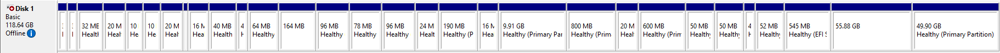
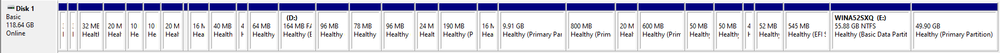

# Install Windows

> [!CAUTION]
> Please read everything slowly and carefully! DO NOT run a command twice if something has failed.
> 
> If you see a warning/error during the proccess, DO NOT continue (unless the guide states that it's normal).
> 
> Instead, ask for help in the Telegram group.
>
> And most importantly, **DO NOT reboot** your phone in this proccess.

> [!WARNING]  
> If you do not follow the guide exactly as it's written, you will most certainly brick your device.
> 
> **Please note that in case you do brick your phone, firehorse is not available, so chances of recovering are slim to none.**

<br>

## Activate **Mass storage mode** using this command

```cmd
adb shell msc
```

## Change Samsung UFS from offline to online


Please run the **Disk Management** program in Windows.

Type "Disk Management" in Windows search and click on "Create and format hard disk partitions"

Find your phone's disk, Disk Management should report it as offline:



Right click on your disk and select the "Online" option.

Now you will see just one partition instead of multiple individual ones.
That's because Windows corrupted your phone's GPT partition table after you have set it to Online.
To fix it, follow the steps below.

<br>

## Restore GPT

Please start adb shell using this command

```cmd
adb shell
```

You need gdisk to recover the GPT. Enter this command to use gdisk.

```cmd
gdisk /dev/block/sda
```
<br>

You will now see multiple warnings from gdisk. That's normal, follow the guide below.

>Command (? for help):

**If this phrase appears, enter (r)**


>Recovery/transformation command (? for help):


**If you entered it correctly, this message will appear, now enter (c)**

>Warning! This will probably do weird things if you've converted an MBR to
GPT form and haven't yet saved the GPT! Proceed? (Y/N):

**If this phrase appeared, enter (y)**

>Recovery/transformation command (? for help):

**If you've made it this far, you'll see this message again. Now please enter (w)**

>Final checks complete. About to write GPT data. THIS WILL OVERWRITE EXISTING
PARTITIONS!!
Do you want to proceed? (Y/N):

**Then type (y) when this phrase appears.**

Gdisk will now exit and your UFS LUN should now be online and restored.


To check that, refresh Disk Management and you should see all of your partitions listed:



**Now exit adb shell from your terminal with this command**

```cmd
exit
````

<br>

## Assign letters to disks

Execute diskpart by running this command

```cmd
diskpart
```

**Assign letter `X` to Windows volume**

Select the Windows volume of the phone
> Use `list volume` to find it, it's the ones named "WINA52SXQ" and "ESPA52SXQ"

```diskpart
select volume <number>
```

Assign the letter X
```diskpart
assign letter=x
```

**Assign letter `Y` to esp volume**

Select the esp volume of the phone
> Use `list volume` to find it, it's usually the last one

```diskpart
select volume <number>
```

Assign the letter Y
```diskpart
assign letter=y
```

**Once done, exit diskpart**

```diskpart
exit
```

<br>

## Apply Windows image

> Replace `<path/to/install.wim>` with the actual install.wim path.
> 
> `install.wim` is located in sources folder inside your ISO.
> 
> You can mount the ISO and specify the full path to the .wim file inside the mounted ISO.

```cmd
dism /apply-image /ImageFile:<path/to/install.wim> /index:1 /ApplyDir:X:\
```

**Example command**

For instance, if you have mounted the Windows ISO and copied the full path of install.wim file
in the File Explorer top path bar, the command would look something like this:

```cmd
dism /apply-image /ImageFile:E:\sources\install.wim /index:1 /ApplyDir:X:\
```


<br>

## Install Drivers

> Extract the drivers you downloaded earlier and open a terminal in the drivers directory.

```cmd
.\DriverUpdater.exe -p X: -d definitions\Desktop\ARM64\Internal\a52sxq_platform.xml -r .
```

<br>

## Create Windows BCD boot files for EFI partition

```cmd
bcdboot X:\Windows /s Y: /f UEFI
```

**Allow unsigned drivers**

> Enabling testsigning and integrity checks is crucial, since A52s Windows drivers are not signed.

```cmd
bcdedit /store Y:\EFI\Microsoft\BOOT\BCD /set "{default}" testsigning on

bcdedit /store Y:\EFI\Microsoft\BOOT\BCD /set "{default}" nointegritychecks on

bcdedit /store Y:\EFI\Microsoft\BOOT\BCD /set "{default}" recoveryenabled no

bcdedit /store Y:\EFI\Microsoft\BOOT\BCD /set "{default}" bootstatuspolicy IgnoreAllFailures
```

>[!WARNING]
>
>If your phone enters Windows [recovery mode](https://learn.microsoft.com/en-us/windows-hardware/manufacture/desktop/windows-recovery-environment--windows-re--technical-reference?view=windows-11),
>it will damage your UFS LUN and brick the device.
>
>This issue only occurs on Samsung devices running Windows.
>
>To make sure that never happens, it is strongly recommended to
> [follow this guide](https://github.com/Project-Silicium/WoA-Guides/blob/main/Mu-Qcom/Vendors/Samsung/remove-win-recovery-disk-checking.md).
>

<br>

## Boot into Windows

To boot Windows, you will need to flash UEFI image to your Android boot partition.

**Copy UEFI (that you downloaded earlier) `<Mu-a52sxq.img>` file to your phone with this command**

```cmd
adb push <Mu-a52sxq.img> /sdcard
```

**If you have an SD Card inserted, use this command**

Make sure SD Card is mounted in recovery before running it.

```cmd
adb push <Mu-a52sxq.img> /sdcard1
```

**Make a backup of your existing boot image**

You need to make a backup of your stock boot image.

Without it you won't be able to boot Android.

You can do this by using the "Backup" function in recovery, or copying the stock boot image to your computer:

```cmd
adb pull /dev/block/bootdevice/boot .
```


**Flash the uefi image from orangefox recovery**

Navigate to the `Mu-a52sxq.img` file in recovery and flash it to boot partition.

> [!IMPORTANT]
>
> Flash UEFI, unplug the USB, and boot. Then, when Windows OOBE appears, connect the USB. If you don't do this, the device will stop when Windows boots.
>

<br>

## Boot back into Android
Reboot to recovery and restore the stock Android boot image backup that you have backed up earlier.

If you didn't do the backup step, you will need to extract the stock boot image from your device firmware.

<br>

## Finished!
> [!CAUTION]
> Do not force the device to shut down after Windows boots.
> 
> Doing that may cause Windows to enter recovery mode the next time you boot Windows, which could damage your device. If you force reboot by mistake, do not boot Windows, but boot into Orange Fox Recovery and reinstall Windows.
> 
> This can be avoided if you [remove Windows recovery environment entirely](https://github.com/Project-Silicium/WoA-Guides/blob/main/Mu-Qcom/Vendors/Samsung/remove-win-recovery-disk-checking.md) from your device.
