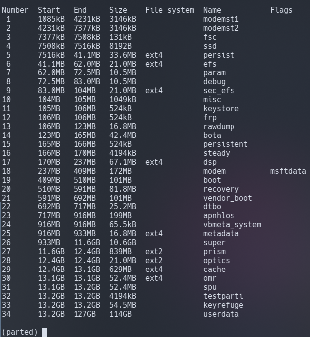

# Partitioning your device

## Notes:

> [!WARNING]  
> Do not run the same command twice unless specified.
> 
> DO NOT REBOOT YOUR PHONE! If you think you made a mistake, ask for help in the [Telegram chat](https://t.me/a52sxq_uefi).
>
> If there is anything you do not understand or have difficulty with, please ask through [Telegram chat](https://t.me/a52sxq_uefi).
> 
> Do not run all commands at once, execute them in order! 
>
> YOU CAN BREAK YOUR DEVICE WITH THE COMMANDS BELOW IF YOU DO THEM WRONG!!!
> 

## Prerequisites

- Bootloader already unlocked

- [OrangeFox recovery](https://github.com/cloudsweets/Port-Windows-11-Galaxy-A52s-5G/releases/tag/file)

- [Platform Tools](https://developer.android.com/tools/releases/platform-tools)

- [UEFI](https://github.com/cloudsweets/Port-Windows-11-Galaxy-A52s-5G/releases/tag/file)

- [Windows drivers](https://github.com/arminask/Kodiak-Drivers.git)

- [Disabled vbmeta.tar](https://github.com/cloudsweets/Port-Windows-11-Galaxy-A52s-5G/releases/tag/file)

- [Odin3](https://gitlab.com/Ryzen5950XT/odin_dl/-/raw/main/Odin3_v3.14.4.zip?inline=false)

- [Windows ISO](https://uupdump.net/download.php?id=9be0c3f7-8590-4a1c-b793-aaa0021e412a&pack=en-us&edition=professional)
  Build must be 26090. Leave all default options and click "Create download package".


## Flash modified OrangeFox recovery
>
>1. Power off your phone
>
>2. Connect the phone to your PC with a USB cable and immediately hold **Volume Up** and **Volume Down** buttons simultaneously.
>
>3. Once your phone enters Download mode, open Odin application on your PC.
>
>4. Click **AP** and select the **orangefox.tar** file
>
>5. Click **USERDATA** and select the **vbmeta.tar** file.
>
>6. Click **Start** button to begin flashing, your device will reboot automatically.
>
>7. As soon as the phone turns off, hold the **volume up** and **power** buttons simultaneously to boot into **OrangeFox recovery**.

## Modifying the partition table

**Unmount the Data partition**

Open the menu button in OrangeFox recovery and then click on the **Mount** button. Uncheck the **Data** button.

**Open a terminal/cmd on your PC and enter recovery shell**
```sh
adb shell
```

**Start `parted` program**
```sh
parted /dev/block/sda
```

Enter `p` command to print the existing partitions



You should have 34 partitions in total with the last 34th one being `userdata`.

You will have to delete the `userdata` partition, create Windows partitions and then recreate userdata partition.

<br>

**4. Delete the `userdata` partition**
> Make sure that 34 really is the userdata partition with `p` command first!
```sh
rm 34
```

### Create partitions

**For 128Gb models:**

- Create the ESP partition (571MB)
```sh
mkpart esp fat32 13.2GB 13.8GB
```

- Create the main partition where Windows will be installed to (60GB)
```sh
mkpart win ntfs 13.8GB 73.8GB
```

- Create Android's data partition (53.6GB)
```sh
mkpart userdata ext4 73.8GB 127GB
```

- Make ESP partiton bootable so that the EFI image can detect it
```sh
set 34 esp on
```

**Quit parted**
```sh
quit
```

**Reboot to OrangeFox recovery**
```sh
reboot recovery
```

Rebooting the phone to recovery after modifying partitions is really important.

GPT partition table changes in recovery are only visible after a reboot.

If you don't do this, you won't be able to proceed with the guide!

## Format modified partitions

- Start adb shell again on your PC
```cmd
adb shell
```

- Format the ESP partiton to FAT32
```sh
mkfs.fat -F32 -s1 /dev/block/bootdevice/by-name/esp -n ESPA52SXQ
```

- Format the Windows partition to NTFS
```sh
mkfs.ntfs -f /dev/block/bootdevice/by-name/win -L WINA52SXQ
```

- Format Android data partition

In OrangeFox recovery go to Wipe menu and press Format Data, 
then type `yes`.

<br>

## Check if Android still boots
After making changes to the partition table you need to verify if your phone can still boot Android.

Be sure to verify that by rebooting to system.

## [Next step: Install Windows](install.md)
