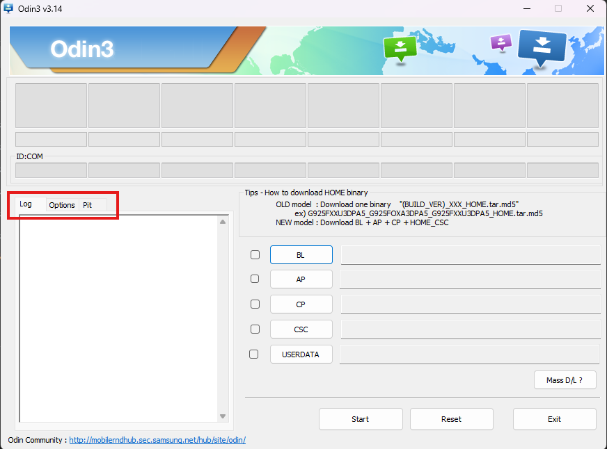

# Uninstall Windows and keep Android

If you decided to remove Windows from your phone and want to restore the stock partition layout, follow this guide.

## Prerequisites

- [Odin3](https://gitlab.com/Ryzen5950XT/odin_dl/-/raw/main/Odin3_v3.14.4.zip?inline=false)

- [PIT file](https://github.com/cloudsweets/Port-Windows-11-Galaxy-A52s-5G/releases/tag/file)

## Boot to Download mode

To flash the PIT file you will need to put your phone to Download mode first.

You can do this in a few ways:

**Boot to Download mode with button combination**
- While the phone is powered off, hold both Volume up and Volume down buttons and connect your
phone to the PC with a USB cable.
- Your phone will now boot to Download mode, then again press
Volume up button to continue and your phone should get detected on Windows.

**Boot to Download mode from recovery**
- If you're using a custom recovery like TWRP or OrangeFox, you can reboot to Download mode
in the recovery's "Reboot" menu and select "Download".

## Flash PIT with Odin

Open Odin application that you have downloaded from the prerequisites section before.

Select the "Pit" tab in Odin.
You will get a warning that this functionality is used for engineers only. You can safely ignore this message.

