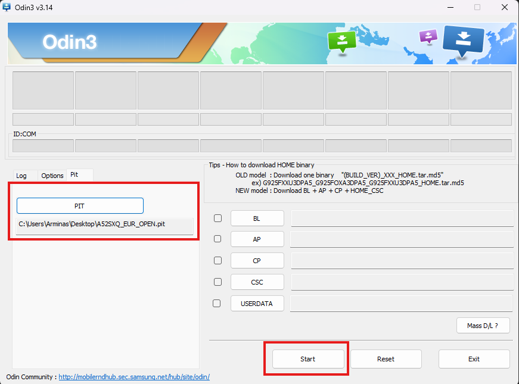

# Uninstall Windows and keep Android

> [!Important]
> **This will wipe all your Android data**
> 

This guide is for removing Windows from your phone and restoring the stock partition layout.

## Prerequisites

- [Odin3](https://gitlab.com/Ryzen5950XT/odin_dl/-/raw/main/Odin3_v3.14.4.zip?inline=false)

- [PIT file](https://github.com/cloudsweets/Port-Windows-11-Galaxy-A52s-5G/releases/tag/file) *

>
> This PIT file is for SM-A528B model with 128GB storage only!
>
> If you have a different A52s model with different storage size, do not flash this file.
>
> Instead, you can extract the PIT file by downloading the stock firmware for your device.
> 
> You will find the PIT file in the CSC .tar.md5 archive in your firmware.
>

## Boot to Download mode

To flash the PIT file you will need to boot your phone to Download mode.

You can do this a few ways:

**Boot to Download mode with button combination**
- While the phone is powered off, hold both Volume up and Volume down buttons together
and connect your phone to the PC with a USB cable.
- Your phone will now boot to Download mode, then again press
Volume up button to continue and your phone should get detected on Windows.

**Boot to Download mode from recovery**
- If you're using a custom recovery like TWRP or OrangeFox, you can reboot to Download mode
in the recovery `Reboot` menu and select `Download`.

## Flash PIT with Odin

Open Odin application that you have downloaded from the prerequisites section before.

Select the `Pit` tab in Odin.
You will get a warning that this functionality is used for engineers only. You can safely ignore this message.

Click on the PIT button and load the PIT file that you have downloaded from the prerequisites before.
After you inserted the file, simply click the `Start` button.

You should see a message in Odin that the flash was successful and your phone should reboot.

If you've done everrything correctly, your phone should be restored to the stock partition layout.
